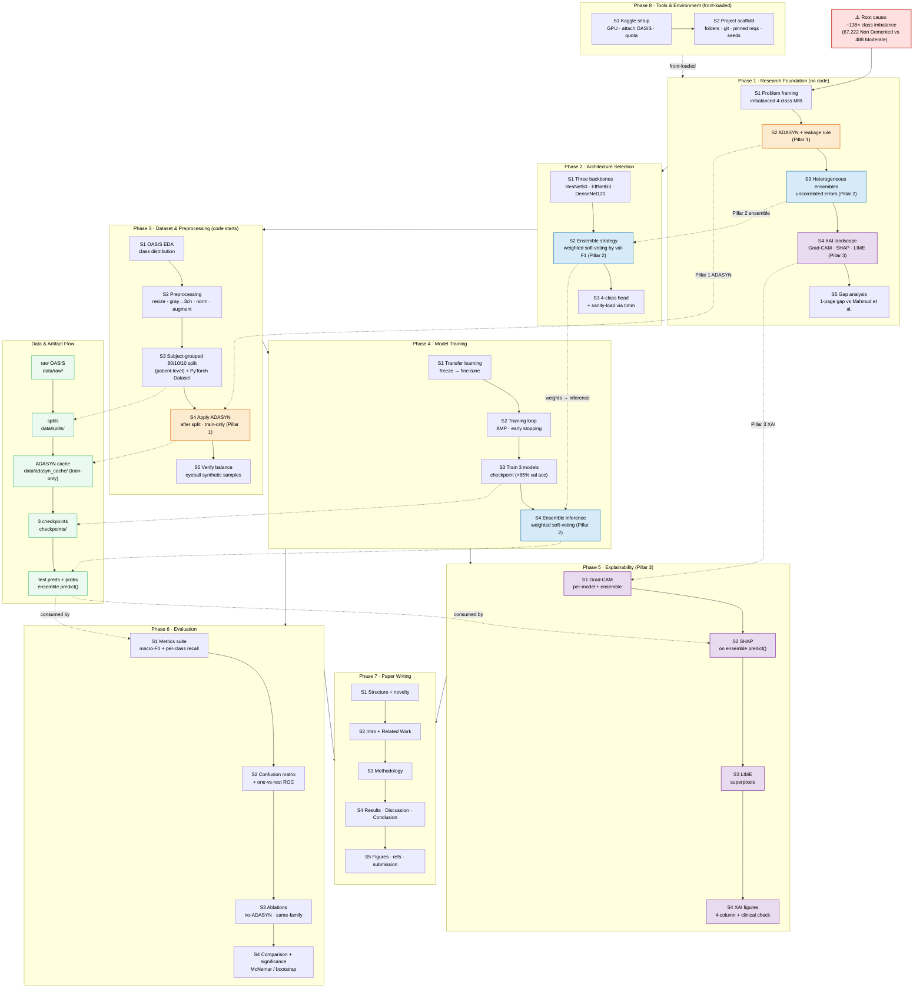

# Research Workflow — Cross-Paradigm Alzheimer's Ensemble

A single flow chart of the end-to-end research, distilled from the 33 step files in this
folder. For the step-by-step curriculum see [`README.md`](README.md); for the full plan see
[`../RESEARCH_PLAN.md`](../RESEARCH_PLAN.md).

The project is **mostly linear (Phase 1 → 7)**, with **Phase 8 (Tools & Environment)
front-loaded** alongside Phase 1. Everything traces back to one root cause — the **~138× class
imbalance** — which spawns the **three pillars** (ADASYN, heterogeneous ensemble, triple XAI)
that thread across multiple phases. A small **data lane** on the right shows how artifacts
flow from raw OASIS (`ninadaithal/imagesoasis`, ~86k slices) to the final paper.

## Legend

| Element | Meaning |
|---|---|
| ⚠️ **Red node** | Root cause — the ~138× class imbalance every decision traces back to |
| 🟠 **Orange nodes** | **Pillar 1 — ADASYN** (designed P1·S2, applied P3·S4) |
| 🔵 **Blue nodes** | **Pillar 2 — Heterogeneous ensemble** / weighted soft-voting by val-F1 (P1·S3 → P2·S2 → P4·S4) |
| 🟣 **Purple nodes** | **Pillar 3 — Triple XAI** Grad-CAM + SHAP + LIME (surveyed P1·S4, produced Phase 5) |
| 🟢 **Green nodes** | Data/artifact lane — files passed between phases |
| **Solid arrow** | Sequential dependency (main phase/step order) |
| **`-.front-loaded.->`** | Phase 8 runs in parallel with Phase 1, not after Phase 7 |
| **Dotted arrow** | A pillar or artifact thread linking steps across phases |

## How to read it

1. **Top to bottom = chronology.** Start at the imbalance, set up the environment (Phase 8)
   while you build foundational understanding (Phase 1), then design (Phase 2), build the
   data (Phase 3), train (Phase 4), explain & evaluate in parallel (Phases 5 & 6), and write
   the paper (Phase 7).
2. **Color = pillar.** The orange/blue/purple nodes show how a single idea introduced in
   Phase 1 is *cashed out* later — e.g. the soft-voting weights designed in P2·S2 are the
   exact ones used at inference in P4·S4.
3. **Green lane = where data lives.** It makes the critical discipline visible: the split
   happens *before* ADASYN, ADASYN touches *train only*, and the ensemble's saved test
   predictions feed both XAI and metrics.
