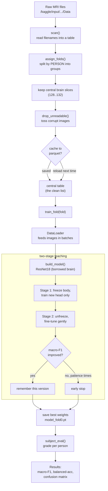
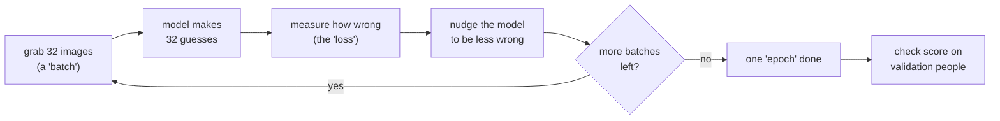

# Running train_kaggle.ipynb (the hands-on guide)

The other file (`train_kaggle_concept.md`) explains **why** we do each thing.
This file explains **how** — the actual tools, the code, every setting, and the
day-to-day routine for running it on Kaggle without running out of your free
hours.

No prior experience assumed. Read it top to bottom. Words in **bold** the first
time they appear are explained right there.

---

## 1. What a "notebook" is, and how to run it

A Kaggle **notebook** is a web page made of stacked boxes called **cells**. Each
cell holds a bit of code. You run cells **top to bottom**, one at a time (or all
at once with "Run All"). Each cell must finish before the next makes sense,
because later cells use things earlier ones created.

Our notebook has 7 numbered sections:

| Section | What it does |
|---|---|
| 1. Config | All the knobs and settings in one place |
| 2. Rebuild the split | Decide which people go in which group |
| 3. Dataset + transforms | Load and clean each picture |
| 4. Model factory | Build the "brain" that makes guesses |
| 5. Train / eval helpers | The grading and one-round-of-teaching tools |
| 6. Two-stage training | The driver that actually does the learning |
| 7. Results | The final report card |

**Golden habit:** run sections 1 → 5 once (they just define tools and are fast),
then section 6 is the slow one that does the real work.

---

## 2. The tools we use (the "packages")

A **package** is a toolbox someone else already wrote, that we borrow. We list
them once here so the code later isn't a mystery.

| Package | In plain words | We use it to… |
|---|---|---|
| `numpy` | fast number-crunching on big lists | do math on scores and arrays |
| `pandas` | a spreadsheet inside Python (a **DataFrame** = a table) | keep the list of images, labels, folds |
| `Pillow` (`PIL`) | opens and edits image files | load each `.jpg` scan |
| `torch` (PyTorch) | the engine that runs the "brain" and does the learning | everything training-related |
| `torchvision` | add-on to torch, made for images | ready-made models + picture cleanup steps |
| `scikit-learn` (`sklearn`) | classic data-science helpers | make the split + compute scores |
| `os`, `re`, `glob`, `pathlib` | small built-in helpers | find files, read names, handle paths |

You don't install any of these on Kaggle — they come pre-installed. That's a big
reason we use Kaggle.

**Where the GPU comes in:** a **GPU** is a chip that does thousands of small
calculations at once, which is exactly what training needs. `torch` automatically
uses it if it's turned on. On a plain CPU the same training can be 10–50× slower.

---

## 3. A naming trap: "slice" means TWO different things

Before anything else, clear this up — it confuses almost everyone.

The word **slice** shows up in two completely unrelated places in this project:

1. **Brain slice** — a physical cross-section of the head (Section 4 below).
   Controlled by `central_lo` / `central_hi`.
2. **"Slice of data"** — a casual phrase for a chunk of *people* (Section 5,
   the folds).

They have nothing to do with each other. Whenever you see "slice," check which
one is meant. In this guide, "brain slice" always means the picture, and we call
the data chunks "folds."

---

## 4. Brain slices: why we keep only the central ones

An MRI machine doesn't take one photo. It scans the head like a loaf of bread —
cutting it into about **240 thin cross-sections**, from the top of the skull down
to the jaw. Each cross-section is saved as one image. Those are the "brain
slices."

```
   top of head
   ┌─────────┐  slice 1     ← mostly skull, barely any brain
   ├─────────┤  ...
   ├─────────┤  slice 128  ┐
   ├─────────┤  slice 130  ├─ CENTRAL: brain is biggest, most detail
   ├─────────┤  slice 132  ┘
   ├─────────┤  ...
   └─────────┘  slice 240    ← mostly neck/jaw, no brain
   bottom
```

The first and last slices are mostly skull, empty space, or neck — almost no
brain tissue. The **middle slices** show the most brain, which is exactly where
Alzheimer's damage appears.

So `central_lo = 128, central_hi = 132` means: **"keep only the 5 middle slices
(128, 129, 130, 131, 132) of each person, throw the rest away."**

**Why this matters so much for speed:** each person has ~240 slices. Keeping 5
instead of 240 is roughly **48× less data** to process, with very little accuracy
lost (the extra slices add little). This single setting is one of your biggest
speed/quota levers.

**When to widen it** (e.g. back to `120..140` = 21 slices): only if your score
plateaus and you suspect the model needs more views of each brain. Start narrow.

---

## 5. How the data is split (folds) — counting PEOPLE, not pictures

This is the part people most often get wrong in their heads. The golden rule:
**we split by PERSON, never by picture** (the concept file explains why — it
prevents cheating). So all the counting below is in *people*.

Let's use a round number, **100 people**, to see the math:

```
100 people total
   │
   ├─ test_frac = 0.20  →  20 people LOCKED AWAY
   │                        (the "final exam" — touched once, ever, at the very end)
   │
   └─ 80 people left  (called the "dev" set)
         │
         └─ n_folds = 5  →  cut into 5 equal groups of 16 people
                fold 0: 16 people
                fold 1: 16 people
                fold 2: 16 people
                fold 3: 16 people
                fold 4: 16 people
```

So yes — **16 people per fold.** Your arithmetic was right; the only fix is that
it's people, not pictures.

**One training run uses one fold as the quiz and the other four to study:**

```
Training on fold 0:
   validation (the "quiz") = fold 0        = 16 people
   training   (the "study")= folds 1,2,3,4 = 64 people
```

Now bring back the brain slices from Section 4. Each person has 5 slices, so in
actual *pictures*:

- Study set ≈ 64 people × 5 = **320 images**
- Quiz set  ≈ 16 people × 5 = **80 images**

### What `run_folds` means and why it's your main quota lever

`run_folds` is simply a to-do list of *which folds to run right now*:

- `run_folds = [0]` → "run fold 0 only, then stop." **One** training run. Cheap.
- `run_folds = [0,1,2,3,4]` → "run all five, each as its own separate run."
  **Five times** the work and five times the GPU cost.

**Why run all five eventually?** With only 16 quiz people, a single score is
shaky — you might get lucky or unlucky depending on *which* 16 people were the
quiz. Running all five (each fold takes a turn being the quiz) and averaging gives
a trustworthy number with a "give or take." This is called **cross-validation**.

**Practical rule:** keep `[0]` the whole time you're experimenting. Switch to
`[0,1,2,3,4]` exactly once, at the very end, for your final reported number.

---

## 6. The training session at a glance (architecture diagram)

This is the whole journey of one run, from files on disk to a report card.



**How to read it:** everything above `train_fold` happens **once** and is cheap.
The box "two-stage teaching" is where the GPU time (and your Kaggle quota) goes.
The `cache` diamond is the trick that lets you skip the slow file-scan on reruns.

---

## 7. What happens inside training (epochs and batches)

The slow part is a loop that repeats many times. Understanding it explains *why*
it takes time.



- A **batch** = a small handful of images processed together (we use 32).
- The **loss** = a single number for "how wrong were those guesses." Lower is
  better. The whole point of training is to push this down.
- One **epoch** = one full pass over *all* the study images.

**"Do we train on the same images every epoch?"** Yes. Within one run, those same
~320 study images are shown again and again — once per epoch. If
`stage2_epochs = 15`, the model may see each image up to 15 times. Each time,
augmentation (small rotate / flip / brightness change) makes it look slightly
different, so the model can't just memorize exact pixels.

So total time ≈ `(number of batches) × (epochs) × (time per batch)`. Everything
in the "save Kaggle limits" section is really about shrinking one of those three
numbers.

---

## 8. Why TWO stages, not one loop?

A very natural question: isn't training just one "predict → measure → improve"
loop? The loop itself *is* just that. The two stages are only about **which parts
of the model are allowed to change** during that loop.

Recall from the concept file: we borrowed a model that already knows how to see
(edges, shapes, textures) from millions of photos. We chopped off its final
decision layer and bolted on a **brand-new, untrained** one for our 3 classes.

Here's the danger:

```
Fresh, clueless new layer   +   Precious borrowed knowledge
   (makes wild guesses)            (took millions of images to build)
```

If we train everything at once from the very start, the wild early mistakes from
the clueless new layer flood backward and **scramble the precious borrowed
knowledge** before the new layer settles. It's like giving a brand-new intern
power to rewrite the whole company playbook on day one.

So we do it gently, in two stages:

| Stage | What can change | Why |
|---|---|---|
| **Stage 1** | Only the new layer (the "head"). Everything else **frozen**. | Let the new layer get roughly sensible *without* risking the borrowed knowledge. |
| **Stage 2** | Everything, but with a **tiny** learning rate. | Now the head is calm, so gently polish the whole model together. |

Both stages run the same predict→measure→improve loop from Section 7. The only
difference is a lock: stage 1 locks most of the model; stage 2 unlocks it and
tiptoes. That's all "two-stage" means.

---

## 9. Every configuration setting explained

All settings live in the `CFG` box in Section 1 of the notebook. Below, each one:
what it means, what changing it does, and **what to check before you touch it**.

### Data + split settings

| Setting | Plain meaning | If you increase it | Check before changing |
|---|---|---|---|
| `data_root` | where the images live | — | Only touch if the auto-finder printed the wrong path. Look at the `data_root ->` line. |
| `seed` | the "fixed dice" for reproducibility (see concept file, Step 1) | different random split & shuffling | Keep it fixed at 42 while comparing ideas, or comparisons become unfair. |
| `test_frac` | share of people locked away for the final exam (0.20 = 20%) | fewer people to learn from | Rarely change. Smaller test = shakier final number. |
| `n_folds` | how many equal groups the rest is cut into | — | 5 is standard. Don't change mid-project. |
| `run_folds` | **which** folds to run now (Section 5) | more folds = proportionally longer run | `[0]` for cheap experiments; `[0,1,2,3,4]` only for the final run. **Your main quota lever.** |

### Brain-slice + image settings

| Setting | Plain meaning | If you increase it | Check before changing |
|---|---|---|---|
| `central_lo`, `central_hi` | which brain slices to keep (Section 4) | more images per person → slower but maybe more accurate | Currently `128..132` (narrow = fast). Widen to `120..140` only if accuracy is stuck. **Changing this rebuilds the cache automatically.** |
| `img_size` | pixel size each image is resized to (224×224) | slower, more memory | The borrowed model expects 224. Leave it unless you know why. |
| `batch_size` | images processed together (32) | faster per epoch but more GPU memory | If you get "out of memory," **lower** this (16, or 8). |

### Learning settings (deeper notes below the table)

| Setting | Plain meaning | If you increase it | Check before changing |
|---|---|---|---|
| `backbone` | which borrowed brain to use | `resnet50` is bigger/slower/maybe better | Start with `resnet18`. Try `resnet50` only after resnet18 works, then compare. |
| `stage1_epochs` | rounds of training the new head only (3) | longer stage 1 | 3 is plenty; the head learns fast. |
| `stage2_epochs` | max rounds of fine-tuning everything (15) | longer, better up to a point | Early stopping usually ends it before 15 anyway. |
| `lr_head` | learning speed in stage 1 (0.001) | faster but reckless | Leave unless training looks unstable. |
| `lr_backbone` | learning speed in stage 2 (0.00001) | risk of wrecking borrowed knowledge | Keep it tiny on purpose. |
| `weight_decay` | gentle "stay humble" pressure (0.0001) | simpler model, less memorizing | Advanced knob; leave at default. |
| `patience` | no-improvement rounds allowed before we stop (3) | trains longer before giving up | Lower = saves time; higher = more thorough. |
| `num_workers` | background helpers that load images (2) | faster loading, more memory | 2 is safe on Kaggle. Raising it sometimes crashes. |

**The learning knobs, in plain words:**

- **Learning rate (`lr_head`, `lr_backbone`)** — how big a correction step the
  model takes each time it's wrong. Big step = fast but reckless (can overshoot
  and get worse); small step = slow but careful. Stage 1 uses a normal step for
  the fresh head; stage 2 uses a *tiny* step so it polishes the borrowed knowledge
  instead of wrecking it.

- **`weight_decay`** — a gentle nudge telling the model "prefer small, modest
  numbers inside yourself." A model with huge internal numbers tends to *memorize*
  specific training people (called **overfitting**). Keeping numbers small forces
  it to learn general patterns. Think of it as a "don't over-obsess" pressure.
  `0.0001` is a standard mild amount.

- **`patience`** (part of **early stopping**) — after each stage-2 epoch we check
  the quiz score. If it doesn't improve, that's a strike. `patience = 3` means
  "after 3 epochs in a row with no improvement, stop — more training would just
  cause memorizing." We always keep the *best* version we saw, not the last one.

### The three "saver" switches (added for you)

| Setting | Plain meaning | Turn it off if… |
|---|---|---|
| `use_sampler` | show rare (sick) groups more often, so the model doesn't ignore them | you want to compare against the old weighted-loss behavior |
| `use_amp` | **mixed precision** — do the math in a lighter number format = ~2× faster on GPU | you ever see strange `NaN` losses (very rare) |
| `cache_split` | save the cleaned image list so reruns skip the slow file scan | you changed the data itself and want a fresh scan |

**More on `use_amp` (mixed precision):** numbers can be stored "heavy and precise"
or "light and approximate." Most of training doesn't need full precision, so AMP
does the math in the *light* format where it's safe. Result: about 2× faster and
less GPU memory used, with basically no accuracy loss. A free win — keep it on.

**More on `use_sampler`:** this is the image-appropriate way to fight class
imbalance. Instead of inventing fake images (SMOTE/ADASYN don't fit raw images),
we simply *show the rare groups more often* during study, so the model can't
lazily ignore them.

**Rule of thumb:** the only settings a beginner should routinely change are
`run_folds` (how much to run), `central_lo/hi` (speed vs. accuracy), `backbone`
(which model), and `batch_size` (only if you hit memory errors). Leave the rest.

---

## 10. Key implementation details (worth understanding)

**The split is rebuilt, not loaded.** Old saved splits have Windows paths that
don't exist on Kaggle. `assign_folds()` recreates the exact same groups because
`seed` is fixed. See `train_kaggle_concept.md` Step 2 for why.

**Grayscale → 3 colors.** MRI scans are gray, but the borrowed model expects color
(3 channels). We copy the gray shade into all three channels. It adds no
information — it just matches the expected format.

**Retry on bad reads.** Kaggle file mounts occasionally hand back a half-read
file. The dataset code retries the same file a few times, then skips to the next,
so a single glitch never kills a whole run.

**Two optimizers, on purpose.** Stage 1 only updates the new head; stage 2 updates
everything. That's why the code builds a fresh optimizer between stages (see
Section 8).

**Early stopping keeps the *best*, not the *last*.** After each stage-2 round we
score on validation people, store a copy of the best-scoring version, and load it
back at the end — so a late bad round can't hurt us.

**Per-person grading.** `subject_eval()` averages all of one person's
picture-guesses into a single vote for that person, then scores per person — the
honest way to grade (concept file, Step 5).

**Model is saved.** Each fold writes `model_fold0.pt` to `/kaggle/working/`. That
file is the trained brain; you can reload it later instead of retraining
(Section 12).

---

## 11. Not hitting the Kaggle free limits

Kaggle gives you, for free:

- **~30 GPU hours per week** (resets weekly, rolling).
- **Max 12 hours per single session** (a longer run gets killed).
- A **9-hour** cap for committed/scheduled ("Save & Run All") runs.

Think of the 30 hours like a phone data plan. How to make it last:

1. **Experiment on ONE fold.** Keep `run_folds = [0]`. This is the single biggest
   saver — 5× cheaper than all folds. Run all five only once, at the very end.

2. **Use the narrow brain-slice window.** `128..132` uses ~48× fewer images than
   the full scan and ~5× fewer than `120..140`. Only widen if your score plateaus.

3. **Keep mixed precision on** (`use_amp = True`). Free ~2× GPU speedup.

4. **Let the cache work.** With `cache_split = True`, the slow file-scan happens
   once per session; reruns of Section 2 load instantly.

5. **Don't leave the tab idle with the GPU on.** The clock runs whenever the
   session is active with GPU enabled — even while you're just reading. Click
   **Stop Session** (top-right) when you pause.

6. **Turn the GPU OFF while writing/editing code.** If you're only editing text or
   testing non-training cells, set the accelerator to "None." GPU hours only burn
   when the GPU accelerator is on.

7. **Watch the session timer.** Kaggle shows your remaining weekly GPU hours in the
   right-hand panel. Glance at it before a long run.

8. **Estimate before committing.** Note how long one stage-2 epoch takes (the gap
   between two `[s2 ...]` prints). Multiply by ~15 for one fold, then by 5 for all
   folds. If that's more than your remaining hours, don't start — shrink the
   window or run fewer folds.

**One-line summary:** *stay on fold 0, keep the window narrow and AMP on, and Stop
the session the moment you're not actively training.*

---

## 12. Your general Kaggle workflow (step by step)

A repeatable routine for each work session:

1. **Open the notebook** on Kaggle.
2. **Attach the dataset** if needed: "Add Input" → search `ninadaithal/imagesoasis`
   (or your own upload) → Add.
3. **Set the accelerator:**
   - Editing/reading only? Accelerator = **None** (saves hours).
   - About to train? Accelerator = **GPU T4 x2** or **P100**.
4. **Run sections 1–5.** Fast. Check the printed `data_root ->` line and that the
   per-fold subject counts look sane.
5. **Confirm `run_folds = [0]`** for experiments.
6. **Run Section 6** (training). Watch the `[s2 ...]` lines — `val_macroF1` should
   generally climb, then plateau.
7. **Run Section 7** to read the report card. Compare macro-F1 to the 0.767 lazy
   baseline.
8. **Change ONE thing** (e.g. try `resnet50`, or widen slices), then repeat from
   step 6. One change at a time is how you learn what actually helps.
9. **When happy:** set `run_folds = [0,1,2,3,4]`, run once, record mean ± std.
10. **Stop the session** so you don't leak GPU hours.

**Save your work:** click **"Save Version"** to keep a snapshot (code + outputs).
"Save & Run All (Commit)" runs the whole thing in the background — handy for the
final full run, but it counts against the 9-hour commit limit.

---

## 13. Reusing a saved model (skip retraining)

Because each run saves `model_fold0.pt`, you can load it back instead of training
again. In a fresh cell, after Sections 1–5 have run:

```python
model = build_model(CFG["backbone"]).to(device)
model.load_state_dict(torch.load("/kaggle/working/model_fold0.pt", map_location=device))
model.eval()   # switch to "just make predictions" mode
```

Then you can call `subject_eval(model, some_loader)` without spending a single
training minute.

**Important:** `/kaggle/working/` is wiped when a **new** session starts, unless
you saved the notebook version (its output is kept) or turned on persistence. To
keep a model for sure, **download** the `.pt` file from the output panel, or save
the version.

---

## 14. Common errors and what they mean

| Message you see | What's really wrong | Fix |
|---|---|---|
| `No images found under ...` | dataset not attached, or wrong path | Add the dataset via "Add Input"; check the `data_root ->` printout |
| `CUDA out of memory` | batch too big for the GPU | Lower `batch_size` to 16 (or 8) |
| Training is extremely slow | GPU is off | Set Accelerator to GPU and rerun |
| `dropped N unreadable image(s)` | a few corrupt files (normal in small numbers) | Ignore if small; if most are bad, re-upload the dataset |
| Session died at ~12 hours | hit the per-session limit | Run fewer folds, or narrow the slice window |
| Scores look *too* good (0.98+) | probably a data leak (split by picture, not person) | Don't change the split code — that's exactly what protects you |

---

## 15. Quick pre-flight checklist

Before you press "Run" on a training session, confirm:

- [ ] Dataset is attached and `data_root ->` printed a real path.
- [ ] Accelerator is set to **GPU** (for training) or **None** (for editing).
- [ ] `run_folds = [0]` unless this is the final full run.
- [ ] You changed **only one** setting since the last run.
- [ ] `seed` is still 42 (fair comparison).
- [ ] You have enough weekly GPU hours left for the run you're about to start.

That's the whole system. Read the concept file for the *why*, use this file for
the *how*, and keep the checklist handy until it's second nature.
