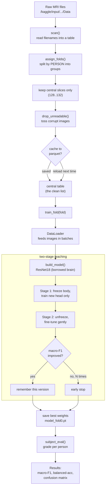
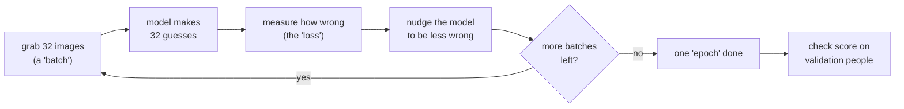

# Running train_kaggle.ipynb (the hands-on guide)

The other file (`train_kaggle_concept.md`) explains **why** we do each thing.
This file explains **how** — the actual tools, the code, every setting, and the
day-to-day routine for running it on Kaggle without running out of your free
hours. No prior experience assumed. Words in *italics* are the one time we use a
technical term; each is explained right there.

---

## 1. What a "notebook" is, and how to run it

A Kaggle **notebook** is a web page made of stacked boxes called **cells**. Each
cell holds a bit of code. You run cells **top to bottom**, one at a time (or all
at once with "Run All"). Each cell must finish before the next one makes sense,
because later cells use things the earlier ones created.

Our notebook has 7 numbered sections:

| Section | What it does |
|---|---|
| 1. Config | All the knobs and settings in one place |
| 2. Rebuild the split | Decide which people go in which group |
| 3. Dataset + transforms | Load and clean each picture |
| 4. Model factory | Build the "brain" that makes guesses |
| 5. Train / eval helpers | The grading and one-round-of-teaching tools |
| 6. Two-stage training | The driver that actually does the learning |
| 7. Results | The final report card |

**Golden habit:** run sections 1 → 5 once (they just define tools and are fast),
then section 6 is the slow one that does the real work.

---

## 2. The tools we use (the "packages")

A **package** is a toolbox someone else already wrote, that we borrow. We list
them once here so the code later isn't a mystery.

| Package | In plain words | We use it to… |
|---|---|---|
| `numpy` | fast number-crunching on big lists | do math on scores and arrays |
| `pandas` | a spreadsheet inside Python (a *DataFrame* = a table) | keep the list of images, labels, folds |
| `Pillow` (`PIL`) | opens and edits image files | load each `.jpg` scan |
| `torch` (PyTorch) | the engine that runs the "brain" and does the learning | everything training-related |
| `torchvision` | add-on to torch, made for images | ready-made models + picture cleanup steps |
| `scikit-learn` (`sklearn`) | classic data-science helpers | make the split + compute scores |
| `os`, `re`, `glob`, `pathlib` | small built-in helpers | find files, read names, handle paths |

You don't install any of these on Kaggle — they come pre-installed. That's a big
reason we use Kaggle.

**Where the GPU comes in:** a *GPU* is a chip that does thousands of small
calculations at once, which is exactly what training needs. `torch` automatically
uses it if it's turned on. On a plain CPU the same training can be 10–50× slower.

---

## 3. The training session at a glance (architecture diagram)

This is the whole journey of one run, from files on disk to a report card.



**How to read it:** everything above `train_fold` happens **once** and is cheap.
The box called "two-stage teaching" is where the GPU time (and your Kaggle quota)
goes. The `cache` diamond is the trick that lets you skip the slow file-scan on
repeat runs.

---

## 4. What happens inside training (the batch loop)

The slow part is a loop that repeats many times. Here's the idea in plain words,
because understanding this explains *why* it takes time.



- A **batch** = a small handful of images (we use 32) processed together.
- One **epoch** = one full pass over *all* the training images.
- We do several epochs. More epochs = more learning, but also more time and more
  risk of memorizing. *Early stopping* (Section 6) decides when to quit.

So total time ≈ `(number of batches) × (epochs) × (time per batch)`. Everything
we do to "save Kaggle limits" is really about shrinking one of those three
numbers.

---

## 5. Every configuration setting explained

All settings live in the `CFG` box in Section 1. Here is each one: what it means,
what changing it does, and **what to check before you touch it**.

### Data + split settings

| Setting | Plain meaning | If you increase it | Check before changing |
|---|---|---|---|
| `data_root` | where the images live | — | Only touch if the auto-finder printed the wrong path. Look at the `data_root ->` line it prints. |
| `seed` | the "fixed dice" for reproducibility | different random split & shuffling | Keep it fixed at 42 while comparing ideas, or comparisons become unfair. |
| `test_frac` | share of people locked away for the final test (0.20 = 20%) | fewer people to learn from | Rarely change. Smaller test = shakier final number. |
| `n_folds` | how many equal groups the rest is cut into | — | 5 is standard. Don't change mid-project. |
| `run_folds` | **which** groups to actually train on now | more folds = longer run | `[0]` for cheap experiments; `[0,1,2,3,4]` only for the final run. **This is your main quota lever.** |

### Image settings

| Setting | Plain meaning | If you increase it | Check before changing |
|---|---|---|---|
| `central_lo`, `central_hi` | which "slices" of the brain to keep (a scan is many slices; middle ones show the most) | more images per person → slower but maybe more accurate | Currently `128..132` (narrow = fast). Widen to `120..140` only if accuracy is stuck. **Changing this rebuilds the cache automatically.** |
| `img_size` | pixel size each image is resized to (224×224) | slower, more memory | The borrowed model expects 224. Leave it unless you know why. |
| `batch_size` | images processed together (32) | faster per epoch but more GPU memory | If you get an "out of memory" error, **lower** this (e.g. 16). |

### Learning settings

| Setting | Plain meaning | If you increase it | Check before changing |
|---|---|---|---|
| `backbone` | which borrowed brain to use | `resnet50` is bigger/slower/maybe better | Start with `resnet18`. Try `resnet50` only after resnet18 works, and compare scores. |
| `stage1_epochs` | rounds of training the new head only (3) | longer stage 1 | 3 is plenty; the head learns fast. |
| `stage2_epochs` | max rounds of fine-tuning everything (15) | longer, better up to a point | Early stopping usually ends it before 15 anyway. |
| `lr_head` | learning speed in stage 1 (0.001) | faster but reckless | Leave unless training looks unstable. |
| `lr_backbone` | learning speed in stage 2 (0.00001) | risk of wrecking borrowed knowledge | Keep it tiny on purpose. |
| `weight_decay` | gentle pressure to keep the model simple | more = simpler model | Advanced knob; leave at default. |
| `patience` | how many no-improvement rounds before we stop (3) | trains longer before giving up | Lower = saves time; higher = more thorough. |
| `num_workers` | helper processes that load images (2) | faster loading, more memory | 2 is safe on Kaggle. Raising it sometimes crashes. |

### The three "saver" switches (added for you)

| Setting | Plain meaning | Turn it off if… |
|---|---|---|
| `use_sampler` | show rare (sick) groups more often, so the model doesn't ignore them | you want to compare against the old weighted-loss behavior |
| `use_amp` | *mixed precision* — do the math in a lighter number format = ~2× faster on GPU | you ever see strange `NaN` losses (very rare) |
| `cache_split` | save the cleaned image list so reruns skip the slow file scan | you changed the data itself and want a fresh scan |

**Rule of thumb:** the only settings a beginner should routinely change are
`run_folds` (how much to run), `central_lo/hi` (speed vs. accuracy), `backbone`
(which model), and `batch_size` (if you hit memory errors). Leave the rest.

---

## 6. Key implementation details (the parts worth understanding)

**The split is rebuilt, not loaded.** Old saved splits have Windows paths that
don't exist on Kaggle. `assign_folds()` recreates the exact same groups because
the `seed` is fixed. See `train_kaggle_concept.md` Step 2 for why this matters.

**Grayscale → 3 colors.** MRI scans are gray, but the borrowed model expects
color (3 channels). In the dataset code we copy the gray shade into all three
channels. It's not adding information — just matching the expected format.

**Retry on bad reads.** Kaggle file mounts occasionally hand back a half-read
file. The dataset code retries the same file a few times, then skips to the next
one, so a single glitch never kills an entire training run.

**Two optimizers, on purpose.** Stage 1 only updates the new head; stage 2
updates everything. That's why the code builds a fresh optimizer between stages.

**Early stopping keeps the *best*, not the *last*.** After each stage-2 round we
score on validation people. We store a copy of the best-scoring version and, at
the end, load that copy back — so a late round that got worse can't hurt us.

**Per-person grading.** `subject_eval()` averages all of one person's
picture-guesses into a single vote for that person, then scores per person. This
is the honest way to grade (concept file, Step 5).

**Model is saved.** Each fold writes `model_fold0.pt` to `/kaggle/working/`. That
file is the trained brain; you can reload it later instead of retraining (see
Section 9).

---

## 7. Not hitting the Kaggle free limits

Kaggle gives you, for free:

- **~30 GPU hours per week** (it resets weekly, rolling).
- **Max 12 hours per single session** (a run longer than that gets killed).
- A **9-hour** cap specifically for committed/scheduled runs.

Think of the 30 hours like a phone data plan. Here's how to make it last.

**1. Experiment on ONE fold.** Keep `run_folds = [0]`. This is the single biggest
saver — it's 5× cheaper than all folds. Run all 5 folds **once**, at the very end,
when you're happy with everything.

**2. Use the narrow slice window.** `central_lo/hi = 128..132` uses ~5× fewer
images than `120..140`. Only widen it if your score plateaus and you've tried
everything else.

**3. Keep mixed precision on** (`use_amp = True`). Free ~2× speedup on the GPU.

**4. Let the cache work.** With `cache_split = True`, the slow file-scan only
happens once per session; reruns of Section 2 load instantly.

**5. Don't leave the tab idle with the GPU on.** The clock runs whenever the
session is active with GPU enabled — even if you're just reading. When you're done
for now, **Stop** the session (top-right, "Stop Session"). You resume later
without spending hours in between.

**6. Turn the GPU OFF while writing/editing code.** If you're only editing text
or testing non-training cells, switch the accelerator to "None." GPU hours only
burn when the GPU accelerator is on.

**7. Watch the session timer.** Kaggle shows your remaining weekly GPU hours in
the right-hand panel. Glance at it before starting a long run.

**8. Estimate before committing.** Look at how long one stage-2 epoch takes (the
gap between two `[s2 ...]` prints). Multiply by ~15 to estimate one fold, then by
5 for the full run. If that's more than your remaining hours, don't start it —
shrink the slice window or run fewer folds first.

**One-line summary:** *stay on fold 0, keep the window narrow and AMP on, and Stop
the session the moment you're not actively training.*

---

## 8. Your general Kaggle workflow (step by step)

A repeatable routine for each work session:

1. **Open the notebook** on Kaggle (kaggle.com → your notebook).
2. **Attach the dataset** if not already: "Add Input" → search
   `ninadaithal/imagesoasis` (or your own upload) → Add.
3. **Set the accelerator:**
   - Just editing/reading? Accelerator = **None** (saves hours).
   - About to train? Accelerator = **GPU T4 x2** or **P100**.
4. **Run sections 1–5.** These are fast (define tools, build the split). Check the
   printed `data_root ->` line and the per-fold subject counts look sane.
5. **Confirm `run_folds = [0]`** for experiments.
6. **Run Section 6** (the training). Watch the `[s2 ...]` lines — `val_macroF1`
   should generally climb, then plateau.
7. **Run Section 7** to read the report card. Compare macro-F1 to the 0.767 lazy
   baseline.
8. **Decide one change** (e.g. try `resnet50`, or widen slices), change **only
   that one thing**, and repeat from step 6. Changing one thing at a time is how
   you learn what actually helps.
9. **When happy:** set `run_folds = [0,1,2,3,4]`, run the full thing once, and
   record the mean ± std.
10. **Stop the session** when done so you don't leak GPU hours.

**Save your work:** click **"Save Version"** to keep a snapshot (code + outputs).
"Save & Run All (Commit)" runs the whole thing start to finish in the background —
handy for the final full run, but it counts against the 9-hour commit limit.

---

## 9. Reusing a saved model (skip retraining)

Because each run saves `model_fold0.pt`, you can load it back instead of training
again. In a fresh cell, after Sections 1–5 have run:

```python
model = build_model(CFG["backbone"]).to(device)
model.load_state_dict(torch.load("/kaggle/working/model_fold0.pt", map_location=device))
model.eval()   # switch to "just make predictions" mode
```

Then you can call `subject_eval(model, some_loader)` without spending a single
training minute.

**Important:** `/kaggle/working/` is wiped when a **new** session starts, unless
you saved the notebook version (its output is kept) or turned on persistence. To
keep a model for sure, **download** the `.pt` file from the output panel, or save
the version.

---

## 10. Common errors and what they mean

| Message you see | What's really wrong | Fix |
|---|---|---|
| `No images found under ...` | dataset not attached, or wrong path | Add the dataset via "Add Input"; check the `data_root ->` printout |
| `CUDA out of memory` | batch too big for the GPU | Lower `batch_size` to 16 (or 8) |
| Training is extremely slow | GPU is off | Set Accelerator to GPU and rerun |
| `dropped N unreadable image(s)` | a few corrupt files (normal in small numbers) | Ignore if small; if most are bad, re-upload the dataset |
| Session died at ~12 hours | hit the per-session limit | Run fewer folds, or narrow the slice window |
| Scores look *too* good (0.98+) | probably a data leak (split by picture, not person) | Don't change the split code — that's exactly what protects you |

---

## 11. Quick pre-flight checklist

Before you press "Run" on a training session, confirm:

- [ ] Dataset is attached and `data_root ->` printed a real path.
- [ ] Accelerator is set to **GPU** (for training) or **None** (for editing).
- [ ] `run_folds = [0]` unless this is the final full run.
- [ ] You changed **only one** setting since the last run.
- [ ] `seed` is still 42 (fair comparison).
- [ ] You have enough weekly GPU hours left for the run you're about to start.

That's the whole system. Read the concept file for the *why*, use this file for
the *how*, and keep the checklist handy until it's second nature.
